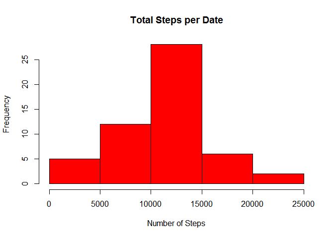
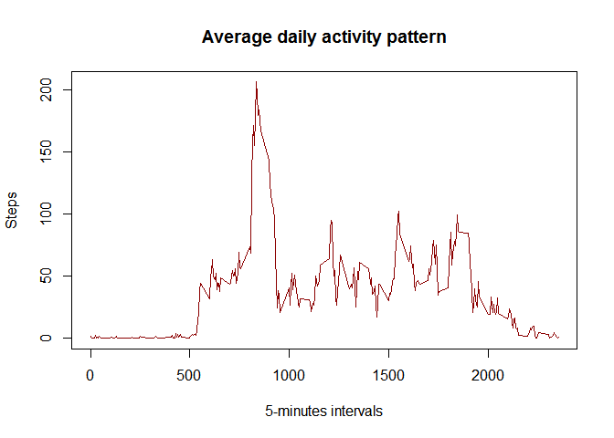

# Reproducible Research: Peer Assessment 1
dariomartinezb  
Friday, September 18, 2015  


## Loading and preprocessing the data


```r
# First I load a bunch of useful libraries
library(dplyr)
library(tidyr)
library(lubridate)

# I'm assuming the data is present in the directory
unzip(zipfile="activity.zip", overwrite=TRUE)
rawdata <- read.csv("activity.csv", stringsAsFactors=FALSE)

# Transform the data frame into a dplyr data frame
rawdata <- tbl_df(rawdata)

# Convert the character-based date into a POSIXct date, assuming UTC
rawdata$date <- ymd(rawdata$date, tz="UTC")

# I do not need incomplete cases, so I create a subset
# with only complete cases
subset_p1 <- rawdata %>% filter(complete.cases(.))
```

## What is mean total number of steps taken per day?
Calculate the total number of steps taken per day

```r
# I need to compute the total steps per date.
totalSteps_sub1 <- subset_p1 %>% 
                    group_by(date) %>%
                    summarise(totalSteps = sum(steps))
```
Make a histogram of the total number of steps taken each day

```r
# Here I plot a histogram of the mean for totalSteps per date
hist(totalSteps_sub1$totalSteps, main = "Total Steps per Date", col="red", xlab="Number of Steps")
```

 

Calculate and report the mean and median of the total number of steps taken per day

```r
# First, let's get the mean and print it
print(mean(totalSteps_sub1$totalSteps))
```

```
## [1] 10766.19
```

```r
# Now, the same for the median
print(median(totalSteps_sub1$totalSteps))
```

```
## [1] 10765
```
## What is the average daily activity pattern?
Make a time series plot (i.e. type = "l" ) of the 5minute interval (xaxis) and the average number of steps taken, averaged across all days (yaxis)

```r
# As I'm still ignoring the missing data observations, I can reuse
# the subset_p1 data, regrouping it on a new dataset by interval.
interval5 <- subset_p1 %>% 
             group_by(interval) %>%
             summarise(meanSteps = mean(steps))

# ...and create the plot
plot(interval5, type="l", main="Average daily activity pattern", xlab="5-minutes intervals", ylab="Steps", col="dark red")
```

 

Which 5-minute interval, on average across all the days in the dataset, contains the maximum number of steps?

```r
print(interval5 %>% filter(meanSteps==max(meanSteps)))
```

```
## Source: local data frame [1 x 2]
## 
##   interval meanSteps
## 1      835  206.1698
```
## Imputing missing values
Calculate and report the total number of missing values in the dataset (i.e. the total number of rows with NA s)

```r
# I compute the nrow of a subset with only NOT complete cases
print(nrow(rawdata %>% filter(!complete.cases(.))))
```

```
## [1] 2304
```
Devise a strategy for filling in all of the missing values in the dataset. The strategy does not need to be sophisticated. For example, you could use the mean/median for that day, or the mean for that 5-minute interval, etc.

```r
# I will verify if an observation is incomplete, and if so, I will
# assign the mean for that particular interval.

avgdata <- mutate(rawdata, steps = ifelse(is.na(steps), interval5[match(rawdata$interval, interval5$interval),2], steps))
avgdata$steps <- as.numeric(avgdata$steps[[1]])
```
## Are there differences in activity patterns between weekdays and weekends?
